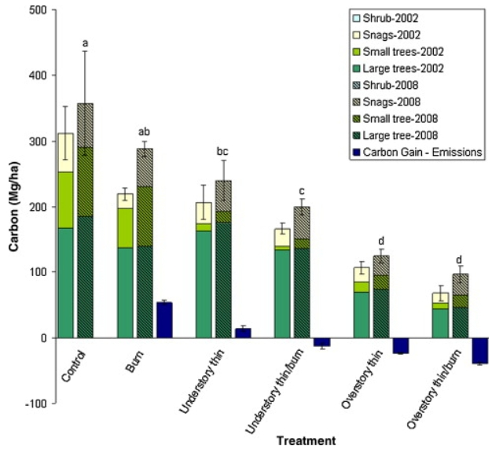

## Setup

```{r}
#| label: set-up
#| message: false
library(tidyverse) # general use
library(here) # file organization
library(janitor) # cleaning data frames
library(readxl) # reading excel files
salinity <- read_csv(here("data",
                         "salinity-pickleweed.csv")) # save salinity-pickleweed data as salinity
personal_data <- read_csv(here("data",
                               "Personal Data 3.4.2026.csv")) |> 
  clean_names() # save personal data as object and clean column names
```

GitHub Repository: https://github.com/sofiaperez422/ENVS-193DS_homework-03

# Problem 1. Slough soil salinity

## a.

The appropriate tests to determine the strength of the relationship between soil salinity and California pickleweed biomass are Pearson's correlation and Spearman rank correlation. Both of these correlation tests describe the strength of the relationship between two variables while indicating directionality, but Pearson's correlation is the parametric version that is used when there is a linear relationship between variables while Spearman rank correlation is the non-parametric version used when there is a monotonic relationship between variables.

## b.

```{r}
#| label: salinity visualization
ggplot(data = salinity, # use salinity data
       (aes(x = pickleweed, # set pickleweed biomass as x-axis
            y = salinity_mS_cm))) + # set salinity as y-axis
  geom_point(color = "darkorchid") + # set data point color
  labs(title = "Salinity increases as pickleweed biomass increases", # create title
       x = "California pickleweed biomass (g)", # label x-axis
       y = "Salinity (mS/cm)") + # label y-axis
  theme_minimal() # change graph theme
```

## c.

### Check assumptions

```{r}
#| label: monotonic relationship between variables
ggplot(data = salinity,# use salinity data
       (aes(x = pickleweed, # set pickleweed as x-axis
            y = salinity_mS_cm))) + # set salinity as y-axis
  geom_point(color = "dodgerblue4") + # change points color
  labs(title = "Monotonic relationship between pickleweed biomass and salinity", # create title
       x = "California pickleweed biomass (g)", # label x-axis
       y = "Salinity (mS/cm)") + # label y-axis
  theme_minimal() # change graph theme
```

The assumptions I checked for were independent observations, and a monotonic relationship between the variables. Independent observations can be affirmed through the method of data collection and how each individual pickleweed plant was independently observed for biomass and soil salinity. The monotonic relationship can be checked visually by plotting the data in relationship to one another. Doing this will let us visualize how increases in pickleweed biomass may relate to the salinity, which in this case we see that soil salinity increases with pickleweed biomass increase, showing a positive monotonic relationship.

### Run test

```{r}
#| label: Spearman rank correlation
cor.test(salinity$salinity_mS_cm, salinity$pickleweed, # run a correlation test to check strength between salinity and biomass
         method = "spearman") # specifcy spearman rank correlation
```

## d.

To evaluate the strength of the relationship between pickleweed biomass and soil salinity, I used a Pearson rank correlation test. I chose this test because when we visualize the data, the distribution appears to have a relationship that may be non-linear (monotonic). I also chose it because of the small amount of observations in the data set resulting in a small sample size, which would make a non-parametric test more appropriate.

We found a moderate relationship between pickleweed biomass and salinity (Spearman $\rho$ = 0.59, S = 824, p = 0.003, $\alpha$ = 0.05).

## e.

From the test, we are able to see that generally the biomass of pickleweed will be higher when soil salinity is higher, and lower soil salinity will be observed with lower biomasses. Therefore, the successful restoration of pickleweed calls for individual plants to be planted in soil with higher salinity.

## f.

```{r}
#| label: Pearson's correlation
cor.test(salinity$salinity_mS_cm, salinity$pickleweed, # run a correlation test to check strength between salinity and biomass
         method = "pearson") # specify pearson's correlation
```

The two tests would have led to the same decision as they both show a positive moderate relationship between pickleweed biomass and soil salinity, since Pearson's r = 0.53 is very similar to Spearman $\rho$ = 0.59, and with both having p-values less than the significance level of 0.05 (Pearson p = 0.009, Spearman p = 0.003), the null that the true correlation/rho of the pickleweed biomass and soil salinity is equal to 0 would be rejected.

# Problem 2. Personal data

## a.

```{r}
#| label: jitter plot of class/no class
ggplot(data = personal_data, # use my_data frame 
       aes(x = class, # set x-axis 
           y = time_with_mobile_game_active_min, # set y-axis 
           color = class)) + # color by yes or no class 
  geom_jitter(width = 0.04,
              height = 0,
              size = 3) + # make size bigger 
  labs(title = "Daily mobile game activity with/without class", # create title 
       subtitle = "Mar. 4, 2026", # subtitle of most recent observation
       x = "Class", # label x-axis 
       y = "Time with mobile game active (min)") + # label y-axis 
  scale_color_manual(values = c("no" = "blueviolet", # color points 
                                "yes" = "cadetblue4")) + 
  theme_light() + # change theme 
  theme(legend.position = "none") # hide legend
```

```{r}
#| label: scatter plot of time at friends
ggplot(data = personal_data,  # use my_data frame 
       aes(x = time_spent_at_friends_hrs, # set x-axis 
           y = time_with_mobile_game_active_min)) + # set y-axis 
  geom_point(size = 5, # plot points and make size bigger 
             color = "maroon") + # change color
  labs(title = "Daily mobile game activity around friends", # create title
       subtitle = "Mar. 4, 2026", # subtitle of most recent observation
       x = "Time spent at friends' (hrs)", # label x-axis 
       y = "Time with mobile game active (min)") + # labal y-axis 
  theme_light() # change theme 
```

## b.

**Figure 1. Daily mobile game activity with/without class.** Points represent individual date observations of time with mobile game active for the day. The points on the left side visualize days where I did not spend any time in class, and the points on the right side visualize days where I did go to class.

**Figure 2. Daily mobile game activity around friends.** Points represent individual date observations of time with mobile game active for the day compared to the time I spent over at a friend's place that same day.

# Problem 3. Affective Visualization

## a.

For my data, affective visualization can look like a drawing of one of the backgrounds from the mobile game with an element across the whole drawing to represent the points of the scatterplot. It would basically be the scatter plot of time spent visiting friends in relation to time with the game open, but as an art piece. I could also do a scatter plot of time spent at lecture compared to time with time spent on the game as another option, or I could combine the two and use different visual elements to represent them. A brainstorm I currently have is to do a darker scenic background with the points being fireflies or some sort of light.

## b.

## c.

## d.

## e.

# Problem 4.

## a.

The statistical tests included in this paper are Analysis of variance (ANOVA) and Tukey HSD mean comparison. The response variable is carbon (C) stocks in MgCha-1. The predictor variable is wildfire risk mitigation treatment. They use these tests to answer the question of what mitigation treatment(s) is most effective in reducing wildfire emissions when a wildfire occurs while also minimizing
excessive removal of long-term carbon storage.



## b.

The figure pretty clearly represents their statistics involving a comparison of multiple means across multiple treatments, and it is ordered nicely to show a decrease in the response variable measured across the treatments. The x-axis being the treatment type while also organizing the different carbon-storing plants measured by the year it was surveyed is very clear. The bars themselves represent the means and the error bars represent the standard error, and the 2008 means rendered significantly different by the statistical tests are indicated by different letters.

## c.

The authors handled visual clutter pretty well, as the organization of treatments and years make it more digestible and not too overwhelming since it is a lot of data. The treatment types also being listed underneath in a vertical tilted style also helps so that it can still fit without being hard to read. There is a lot of data fit into this graph relating to several means of carbon stocks in different plants over two different years across multiple treatments, but there is not too much ink taking up the figure itself. The authors do use themed colors and hatching for the visualization, but the bars are pretty skinny and the legend is also kept at a reasonable size.

## d.

To make the figure better, the authors could use more contrasting and brighter colors, especially for the 2008 mean bars, because the sections separating the plant type have all very dark colors and are somewhat hard to see as separated at first glance. A complimentary color could be used for the 2008 treatment bars to still be able to have more color contrast without being to similar to the 2002 bars. Also, there should be more emphasis on the treatments that resulted in statistically significant means other than just the letter labels above it, like bolded or starred treatment type names, or thicker outlined mean bars.
